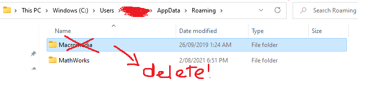

# Downloads:
## Latest version of GrimLite Li v 2.3.2 has been released (Made by Froztt)
[click here to download](https://github.com/nicknggt/Grimlite-Li-GBOT/releases/download/v2.3.2/Grimlite.Li.2.3_Plugins_included.zip)

## To get the latest Grimlite Li GBOT files  which are made by our guild (incl. me) 
[click here to download](https://github.com/nicknggt/Grimlite-Li-GBOT/archive/refs/heads/main.zip)

**NOTE: There might be some gbots that are in progress so be careful for not to use it after downloading, normally these gbots are appeared in the latest date modified but our team will try our best to finish it before committing**

**ALSO NOTE: These GBOT files only worked for GrimLi. Other [Grimoire software](https://auqw.tk/) WON'T WORK. Same thing for other Grim software GBOT(s) which also won't work in GrimLi**

## Stuck at reconnecting in GrimLi?
[Click here to download CleanFlash (v34.0.0.192)](https://github.com/nicknggt/Grimlite-Li-GBOT/releases/download/CleanFlash_34.0.0.192/Flash.Player-20211207T081507Z-001.zip)

## Still not working??
**If it's not working, try to install the older version of CleanFlash:**
[Click here to download CleanFlash (v34.0.0.184)](https://github.com/nicknggt/Grimlite-Li-GBOT/releases/download/CleanFlash_34.0.0.184/CleanFlash_34.0.0.184_Installer.rar). Install it to solve your issue.

**if it also not working, try to do these followings:**
1. Type %AppData% on windows search menu to open "Roaming" folder.

2. Find "Marcomedia" folder inside Roaming and delete it.

3. Restart Grimoire.

## Still not working???
1. open "Control Panel" (You can search that phase in Window search bar and opens it)
2. Inside "Control Panel", Make the option *View by Category*, then click on *Uninstall a program*

3. Click on *"Turn Windows features on or off"*, check if these 2 options are ticked in order to let your computer download those .NET Framework automatically in the latest version.

4. Restart Your computer.

## Still not working????
[¯\_(ツ)_/¯]()

# Changelogs:
## v2.3.2:
- Better performance?
- Override server list

## v2.3.1
- Now support Character Select login
- Fix auto relogin 
- Override server list

## v2.3
- Fix Auto Reject Drop Againn
- Targeted skill Cmd 
- Infinite range for potion/scroll
- Fix some bugs

## v2.2.2
- Fix Auto Reject Drop

## v2.2:
- Bugfix Acccept Quest List
- Bugfix Auto Reject Drops
- re-Add Packet Tamperer
- Packet Spammer in Bot Manager > Misc 2