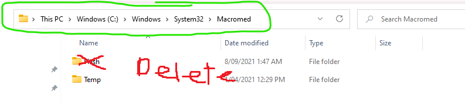

# Downloads
## Latest version of GrimLite Li v2.3.2 has been released (Made by Froztt)
- [click here to download](https://github.com/nicknggt/Grimlite-Li-GBOT/releases/download/v2.3.2/Grimlite.Li.2.3_Plugins_included.zip)
- [Changelogs](#changelogs)

## To get the latest Grimlite Li GBOT files  which are made by our guild (incl. me) 
- [click here to download](https://github.com/nicknggt/Grimlite-Li-GBOT/archive/refs/heads/main.zip)

# Other info
- [GrimLite Rev](#grimrev)
	- [Grimlite Rev Download Link (Newest version v1.3 Official)](https://github.com/GentleGanku/GrimliteRev/releases/download/v1.3-Skyguard/Grimlite.Rev.rar)
- [Reconnect Problem in GrimLi/GrimRev](#Reconnect_Problem)
	- [Method 1](#method_1)
	- [Method 2](#method_2)
	- [Method 3](#method_3)

# Grimlite Rev????
This github page is only focusing on GrimLi software (just stick to this software for now since it's much better than GrimRev). Unless when Ganku aka the GrimRev dev makes a new update which he will upload on the [main website](https://auqw.tk/) and his [github page](https://github.com/GentleGanku/GrimliteRev).

- *Update: [Grimlite Rev v.13 Official Version](https://github.com/GentleGanku/GrimliteRev/releases/download/v1.3-Skyguard/Grimlite.Rev.rar) by [Ganku](https://github.com/GentleGanku)*

**NOTE: These GBOT files in this github ONLY WORKED IN GRIMLI. Other [Grim software](https://auqw.tk/) WON'T WORK. Same thing for other Grim software GBOT(s) which also won't work in GrimLi**

- [Click here if you want to know all about GrimRev and its leaked version](https://github.com/nicknggt/GrimliteRev-GBOT#so-whats-new-about-this-version)

# Reconnect Problem

## Stuck at reconnecting in GrimLi?
[Click here to download CleanFlash (v34.0.0.192)](https://github.com/nicknggt/Grimlite-Li-GBOT/releases/download/CleanFlash_34.0.0.192/Flash.Player-20211207T081507Z-001.zip)

## Still not working??
1. Locate the filepath `C:\Windows\System32\Macromed\` & DELETE the Flash folder

2. Download Flash.rar [(click here to download)](https://github.com/nicknggt/Grimlite-Li-GBOT/releases/download/Macromed_Flash_sys32/Flash.rar)
3. After download it, open the downloaded file by *WinRar Archive* or any other extracting software you know (example: [7zip](https://www.7-zip.org/download.html), etc.)
4. Drag the Flash folder to that filepath

5. Restart your PC if it's not working.

## Still not working???
1. open "Control Panel" (You can search that phase in Window search bar and opens it)
2. Inside "Control Panel", Make the option *View by Category*, then click on *Uninstall a program*

3. Click on *"Turn Windows features on or off"*, check if these 2 options are ticked in order to let your computer download those .NET Framework automatically in the latest version.

4. Restart Your computer.

## Still not working????
`¯\_(ツ)_/¯`

# Changelogs:
## v2.3.2:
- Better performance?
- Override server list

## v2.3.1
- Now support Character Select login
- Fix auto relogin 
- Override server list

## v2.3
- Fix Auto Reject Drop Againn
- Targeted skill Cmd 
- Infinite range for potion/scroll
- Fix some bugs

## v2.2.2
- Fix Auto Reject Drop

## v2.2:
- Bugfix Acccept Quest List
- Bugfix Auto Reject Drops
- re-Add Packet Tamperer
- Packet Spammer in Bot Manager > Misc 2